# 🛍️ StyleHub - E-commerce Web App

StyleHub is a fully functional, feature-rich e-commerce website built for both **Customers** and **Shopkeepers**. It provides a seamless shopping experience with login/signup, product listings, cart, wishlist, and payment integration — along with a dedicated dashboard for shopkeepers.

---

## ✨ Features

### 🔐 Authentication
- Separate **Login/Signup** for Customers and Shopkeepers
- JWT-based secure authentication
- Role-based access control

### 🛒 Customer Panel
- View all listed products with filters and categories
- Add to **Cart** and **Wishlist**
- **Buy Now** option
- **Write and Read Product Reviews**
- **Razorpay** Payment Integration (Free Tier / Test Mode)
  - Online Payment
  - Cash on Delivery (COD)
- **Customer Support Page** for:
  - Return Requests
  - Exchange Requests
- Integrated **AI Chatbot Assistant** for real-time support


### 🧑‍💼 Shopkeeper Dashboard
- Create and manage your **Shop**
- Add, Edit, Delete **Products**
- View orders placed for their products

### 🌟 Common UI Components
- Responsive and modern **Homepage**
- Stylish **Navbar** and **Footer**
- Category-wise product browsing

---

## 🧑‍💻 Tech Stack

### 💻 Frontend
- React.js
- Redux Toolkit
- Tailwind CSS / CSS Modules
- Axios
- Razorpay JS SDK

### 🛠️ Backend
- Node.js
- Express.js
- MongoDB (Mongoose ODM)
- JSON Web Tokens (JWT)

### 📦 Deployment
- Frontend: Vercel / Netlify
- Backend: Render / Railway
- Database: MongoDB Atlas

---
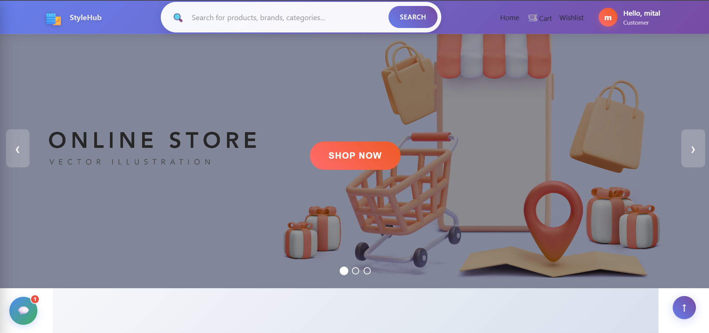  
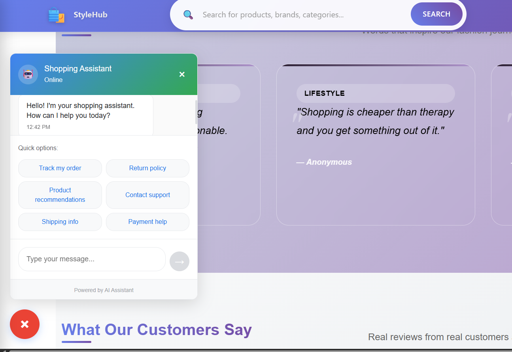  
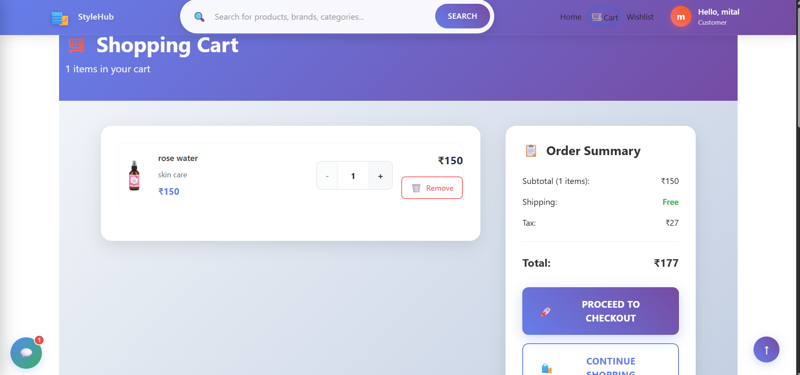  
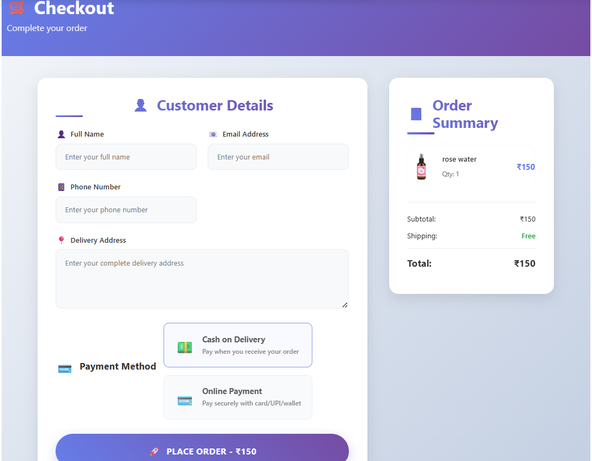  
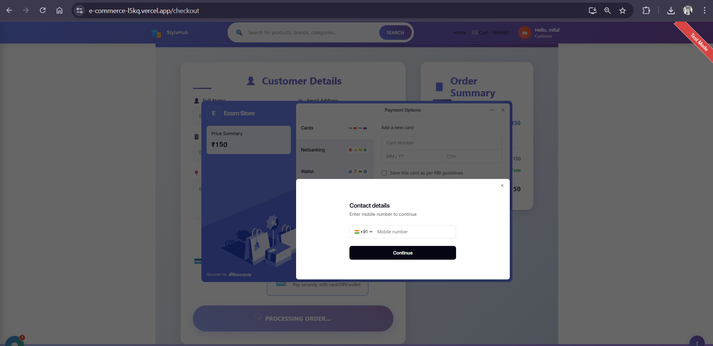  
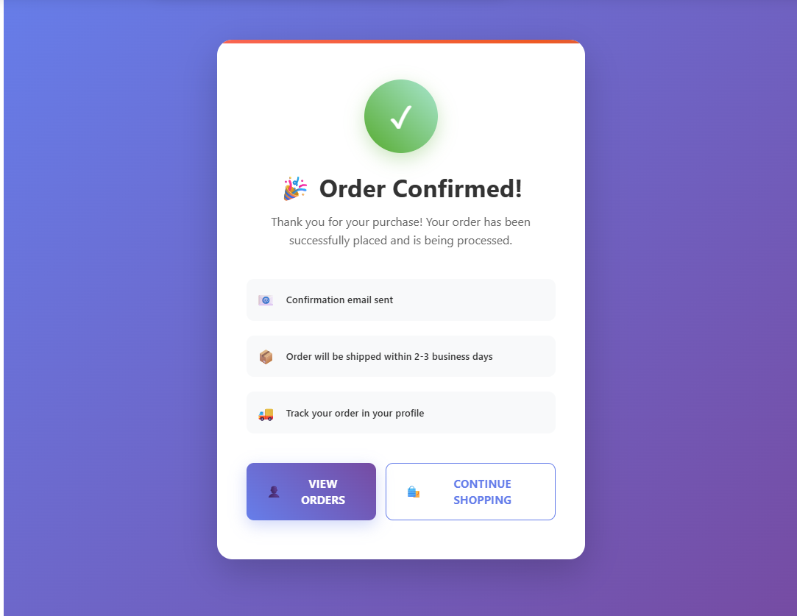  
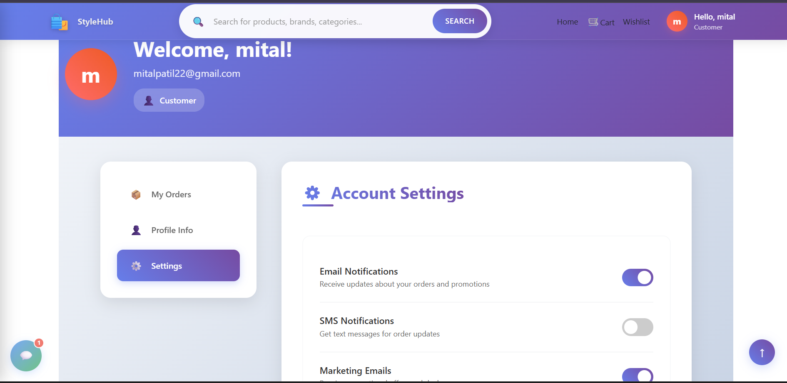  
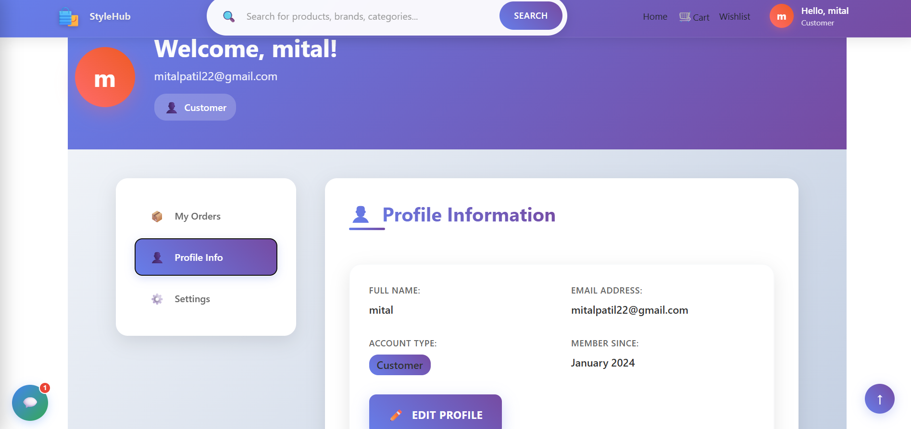  
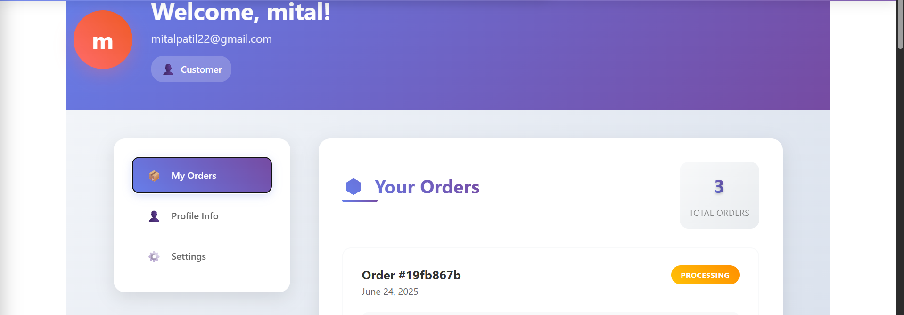  
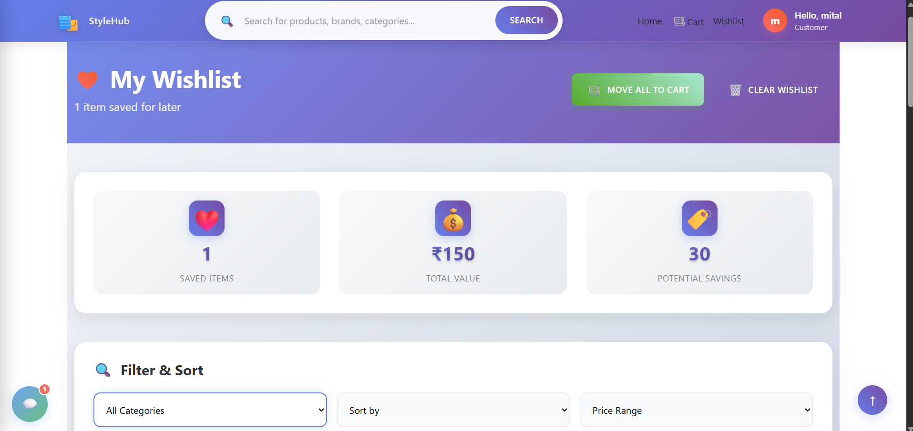  
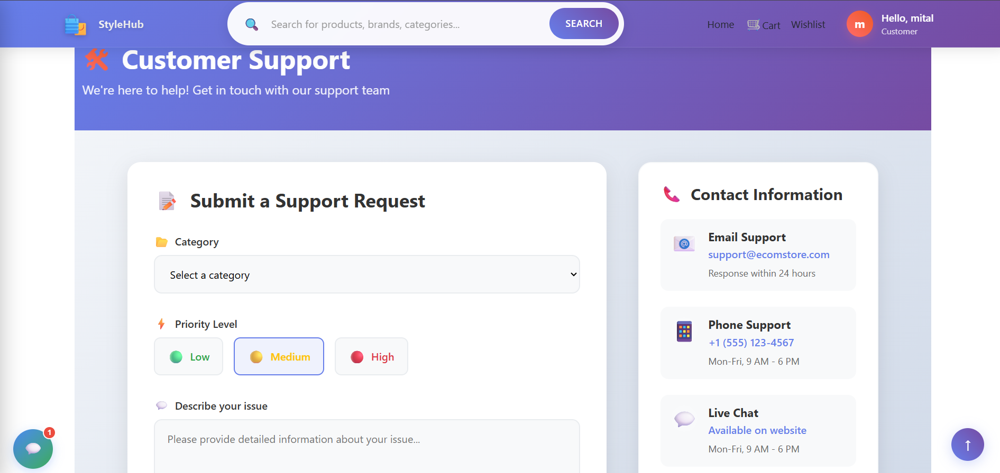  
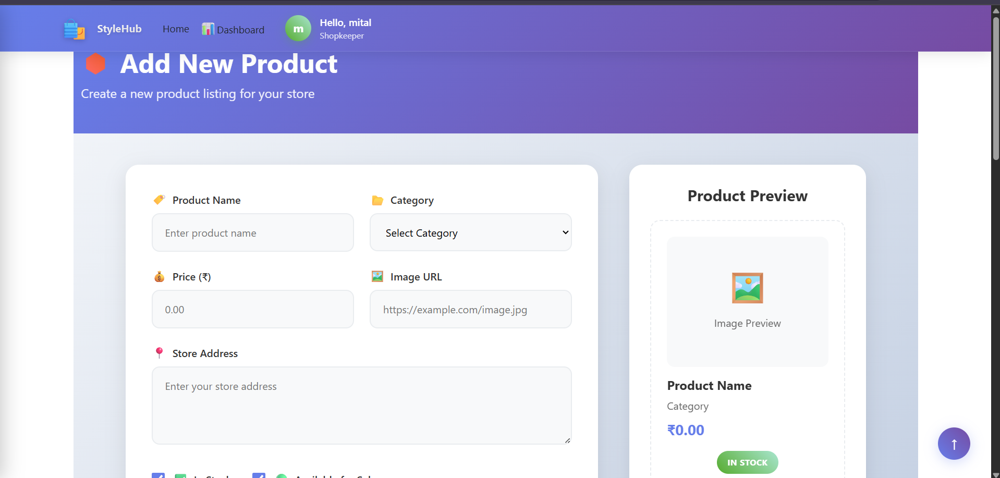  
  

---
## 🔑 Environment Variables

Create a `.env` file in the root directory and add the following:

```env
MONGO_URI=your_mongodb_connection_string
JWT_SECRET=your_jwt_secret
RAZORPAY_KEY_ID=your_key_id
RAZORPAY_KEY_SECRET=your_key_secret
```
----
### 🚀 Getting Started
1.Clone the repository
``` bash
git clone https://github.com/yourusername/stylehub.git
```

2.Navigate to project directories
```bash
cd client # for frontend
npm install
npm start
```
```bash
cd client # for frontend
npm install
npm start
```
## 📄 License
This project is open-source and available under the MIT License.
